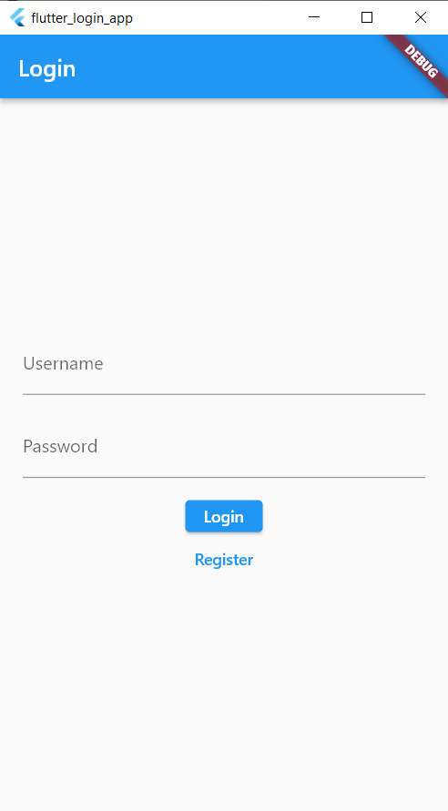

# Flutter Login & Register System with PHP Backend

This README provides step-by-step instructions on how to create a simple Flutter login system with a PHP backend. The system includes login, registration, and session management.
<p align="center">

</p>

## PHP backend setup
1.create your database and your table with thiw query
      
   ```
CREATE DATABASE flutter_login;
USE flutter_login;
CREATE TABLE users (
   id INT AUTO_INCREMENT PRIMARY KEY,
   username VARCHAR(50) NOT NULL,
   password VARCHAR(255) NOT NULL,
   email VARCHAR(100) NOT NULL
   );

```
2.make config.php to connect to the database
```
<?php
$db_host = 'localhost';
$db_user = 'your_username';
$db_pass = 'your_password';
$db_name = 'flutter_login';

$conn = new mysqli($db_host, $db_user, $db_pass, $db_name);

if ($conn->connect_error) {
    die("Connection failed: " . $conn->connect_error);
}
?>

```
3.register.php
```
<?php
require_once('config.php');

if ($_SERVER['REQUEST_METHOD'] == 'POST') {
    $username = $_POST['username'];
    $password = password_hash($_POST['password'], PASSWORD_DEFAULT);
    $email = $_POST['email'];

    $stmt = $conn->prepare("INSERT INTO users (username, password, email) VALUES (?, ?, ?)");
    $stmt->bind_param("sss", $username, $password, $email);
    $stmt->execute();
    $stmt->close();
    echo "Registration successful!";
} else {
    echo "Invalid request";
}
?>

```
4.login.php
```
<?php
require_once('config.php');

if ($_SERVER['REQUEST_METHOD'] == 'POST') {
    $username = $_POST['username'];
    $password = $_POST['password'];

    $stmt = $conn->prepare("SELECT id, password FROM users WHERE username = ?");
    $stmt->bind_param("s", $username);
    $stmt->execute();
    $stmt->bind_result($id, $hashed_password);
    if ($stmt->fetch() && password_verify($password, $hashed_password)) {
        echo "Login successful!";
    } else {
        echo "Invalid username or password";
    }
    $stmt->close();
} else {
    echo "Invalid request";
}
?>

```
that is all you need in the backend site using php

## Flutter Project Setup

1. Create a new Flutter project using the Flutter CLI or your preferred IDE.

   ```bash
   flutter create flutter_login_app
   cd flutter_login_app
   ```

2. Add this to your pubspec.yaml
    ```
    dependencies:
    flutter:
      sdk: flutter
    http: ^0.13.3
    shared_preferences: ^2.0.12
   ```
3. Run "flutter pub get" in your cli to install the dependencies

4. copy all this file to the lib folder in your flutter project
   
   - [api.dart](lib/api.dart)
   - [dashboard.dart](lib/dashboard.dart)
   - [login.dart](lib/login.dart)
   - [main.dart](lib/main.dart)
   - [register.dart](lib/register.dart)
   - [session_manager.dart](lib/session_manager.dart)

5. in the api.dart change the baseUrl const to your own backend server link 
   
   

   
